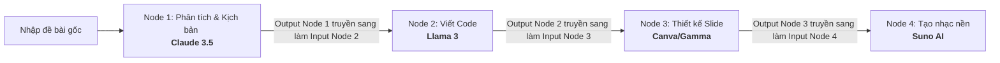

# 🎓 AIaBLE (AI able) - Nền tảng hỗ trợ học tập & tương tác AI thông minh

<p align="center">
  
  
  
  
  
  
</p>

---

## 📝 Giới thiệu dự án

**AIaBLE** là nền tảng quản lý prompt thông minh và hỗ trợ định hướng phương pháp học tập dành riêng cho sinh viên đại học. Dự án được phát triển bởi đội **INTELLICREW** nhằm tối ưu hóa cách sinh viên tương tác với các mô hình ngôn ngữ lớn (LLM), ngăn ngừa việc sao chép bài học thụ động và thúc đẩy tinh thần tự chủ học tập, tư duy phản biện.

---

## 🌟 6 Tính năng cốt lõi (Core Capabilities)

| # | Tính năng | Mô tả chi tiết | Mô hình xử lý |
|---|---|---|---|
| 1 | **Prompt-Optimizer Engine** | Tối ưu hóa các prompt thô sơ, ngắn của sinh viên thành các prompt đầy đủ cấu trúc chuẩn: `Role` + `Context` + `Task` + `Format` + `Constraints` để có kết quả tốt nhất. | `Gemini` |
| 2 | **AI Task-Matcher & n8n Runner** | Phân rã bài tập lớn phức tạp thành chuỗi 5 bước logic liên tiếp. Kết nối đa mô hình đích thực: bước nào dùng AI đó (Claude 3.5, Llama 3, Suno AI...). Hỗ trợ trình diễn đa phương tiện: Audio Player nghe nhạc, Video Player xem phim ngắn, Slideshow Carousel trình bày slide chuyên nghiệp. | `Claude 3.5`, `Suno AI`, `Llama 3`, `Gemini` |
| 3 | **AI Recipe Library** | Thư viện hơn 15+ công thức prompt mẫu chuẩn thuộc các nhóm chủ đề: Lập trình (Coding), Viết báo cáo (Writing/Report), Thiết kế thuyết trình (Slide), và Nghiên cứu khoa học. | Hệ thống quản lý Template |
| 4 | **AI Ethics Guardrail** | Hệ thống bảo vệ học thuật tự động quét các từ khóa gian lận (thi hộ, làm hộ bài,...) và đưa ra bộ câu hỏi phản biện cảnh báo để giúp sinh viên tự học thay vì lạm dụng AI. | `Gemini` |
| 5 | **AI Accuracy Validator** | Nhận văn bản do AI sinh ra, thẩm định chéo với các nguồn dữ liệu mạng internet thời gian thực thông qua Google Search API để chỉ ra mức độ tin cậy của thông tin (Xanh: Đã xác thực, Đỏ: Nguy cơ ảo tưởng/Hallucination). | `Google Search API` + `Gemini` |
| 6 | **AIaBLE Personal Sandbox** | Không gian chạy thử nghiệm AI song song. Nhập một câu prompt duy nhất và đối chiếu đồng thời kết quả trả về của 3 mô hình lớn là **Claude**, **GPT-4**, và **Gemini** trên 3 cột dọc trực quan. | `Anthropic`, `OpenAI`, `Gemini` |

---

## 🔗 n8n-style Multi-step AI Pipeline & Trình diễn Đa phương tiện

Điểm nhấn công nghệ của dự án là **AI Task-Matcher Engine**, được mô phỏng theo cơ chế chạy node liên kết tuần tự của **n8n**:



### Các Widget Trình Diễn Sản Phẩm AI (Multi-Widget Output Engine):
*   **Trình phát nhạc (Audio Player)**: Tự động render trình nghe nhạc HTML5 khi node Suno AI tạo xong bài hát.
*   **Trình phát video (Video Player)**: Phát trực tiếp video mô phỏng độ nét cao từ CDN tương ứng với ngữ cảnh đề bài.
*   **Trình chiếu slide (Slideshow Carousel)**: Tự động phân tách nội dung Markdown của AI qua ký tự `---` thành giao diện các thẻ slide PowerPoint/Gamma để lướt xem trực quan.

---

## 🏗️ Cấu trúc thư mục dự án (Monorepo)

```text
/AIaBLE-Project
├── backend/                  # RESTful API Server (Express + TypeScript)
│   ├── src/
│   │   ├── controllers/      # Bộ điều khiển API (Auth, Project, Matcher, Optimizer...)
│   │   ├── middleware/       # Middleware kiểm tra Token, Chặn chống spam (Rate Limiter)
│   │   ├── routes/           # Định tuyến API endpoints
│   │   └── services/         # Tích hợp SDK AI (Gemini, OpenRouter, Groq, Suno Service)
│   └── tsconfig.json
├── frontend/                 # Client Application (Next.js 14 + Tailwind CSS)
│   ├── src/
│   │   ├── app/              # Next.js App Router (Dashboard, Sandbox, Task-Matcher...)
│   │   ├── components/       # Các UI Components dùng chung & Modals
│   │   └── lib/              # Cấu hình Fetch Client
│   └── tailwind.config.ts
└── README.md                 # Tài liệu hướng dẫn dự án
```

---

## 🚀 Hướng dẫn Cài đặt & Chạy dưới local (Local Setup)

### 📋 Yêu cầu hệ thống
*   **Node.js** (Khuyến nghị phiên bản `v18.x` hoặc `v20.x` trở lên)
*   **npm** (Đi kèm sẵn với Node.js) hoặc **yarn**

### 1. Cài đặt các thư viện (Dependencies)
Từ thư mục dự án gốc `/AIaBLE-Project`, mở terminal và chạy lệnh:
```bash
# Tự động cài đặt thư viện cho cả frontend và backend
npm install
```

### 2. Cấu hình các biến môi trường (Environment Variables)

#### Cấu hình cho Backend:
Tạo file `.env` bên trong thư mục `/AIaBLE-Project/backend/.env` với nội dung sau:
```env
PORT=5001
GEMINI_API_KEY=Nhập_API_Key_Gemini_Của_Bạn
JWT_SECRET=Nhập_Mã_Bảo_Mật_Token_JWT_Tùy_Ý

# Các API Key mở rộng cho bộ định tuyến đa mô hình AI:
OPENROUTER_API_KEY=Nhập_API_Key_OpenRouter_Nếu_Có  # Cho phép gọi Claude 3.5 Sonnet và GPT-4o
GROQ_API_KEY=Nhập_API_Key_Groq_Nếu_Có              # Cho phép gọi Llama 3
APIFRAME_API_KEY=Nhập_API_Key_Apiframe_Nếu_Có      # Cho phép tạo nhạc Suno AI thật
```

#### Cấu hình cho Frontend:
Tạo file `.env.local` bên trong thư mục `/AIaBLE-Project/frontend/.env.local` với nội dung sau:
```env
NEXT_PUBLIC_API_URL=http://localhost:5001
```

### 3. Khởi chạy dự án ở môi trường phát triển (Development)
Từ thư mục gốc `/AIaBLE-Project`, chạy lệnh:
```bash
npm run dev
```
Hệ thống sẽ đồng thời kích hoạt song song 2 luồng:
*   **Frontend Client:** Chạy tại địa chỉ [http://localhost:3000](http://localhost:3000)
*   **Backend Server:** Chạy tại địa chỉ [http://localhost:5001](http://localhost:5001)

---

## 🛡️ Tính ổn định & Cơ chế dự phòng (Robustness & Fallback)

*   **API Rate Limiting**: Tích hợp middleware chống spam request. Mỗi IP bị giới hạn tối đa **20 cuộc gọi API AI trong mỗi 15 phút** nhằm bảo vệ API keys.
*   **Mô phỏng tính cách AI (Model Persona Fallback)**:
    *   Trường hợp thiếu các API Key phụ (OpenRouter/Groq), Backend sẽ tự động kích hoạt chế độ **Emulation** thông qua Gemini.
    *   Hệ thống chèn các bộ quy tắc hệ thống (System instructions) chi tiết để định hình Gemini phản hồi đúng 100% theo phong cách viết và cấu trúc của từng mô hình (Claude: sâu sắc khách quan, Llama: chuyên kỹ thuật, GPT: thực tế bảng biểu).
    *   Đảm bảo quy trình thuyết trình hoặc chạy thử nghiệm của sinh viên luôn trả về đúng phong cách đặc trưng của từng dòng AI mà không bao giờ bị báo lỗi API.
